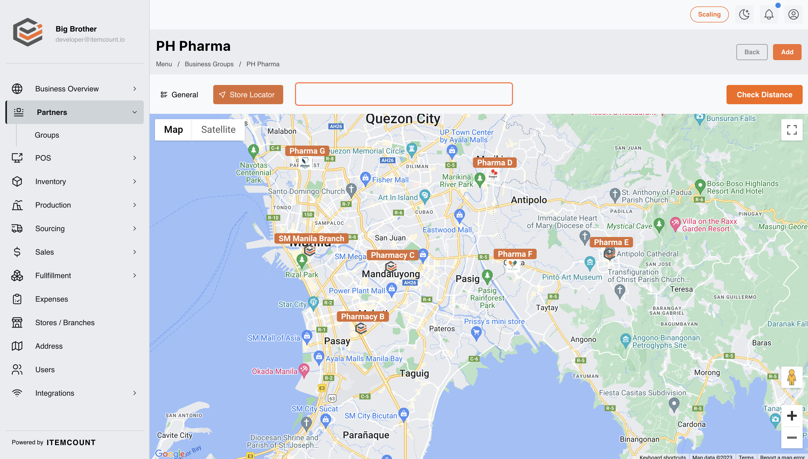

# Monitoring Your Franchisees

1. Click on Groups&#x20;

<figure><figcaption></figcaption></figure>

2. Click on PH Pharma&#x20;

<figure><figcaption></figcaption></figure>

3. Click on General&#x20;

<figure><figcaption></figcaption></figure>

4. Click on Store Locator&#x20;

<figure><figcaption></figcaption></figure>

5. Click on Zoom in&#x20;

<figure><figcaption></figcaption></figure>

6. Drag highlighted element&#x20;

<figure><figcaption></figcaption></figure>

7. Click on Check Distance

<figure><figcaption></figcaption></figure>

8. Type "Oba"&#x20;

<figure><figcaption></figcaption></figure>

9. Click on Obando, Bulacan, Philippines&#x20;

<figure><figcaption></figcaption></figure>

10. Click on Obando Christian ChurchObando, Bulacan, Philippines&#x20;

<figure><figcaption></figcaption></figure>

11. Type "5"&#x20;

<figure><figcaption></figcaption></figure>

12. Click on Close&#x20;

<figure><figcaption></figcaption></figure>

13. Click on General&#x20;

<figure><figcaption></figcaption></figure>

14. Click on Pharmacy A&#x20;

<figure><figcaption></figcaption></figure>

15. Click on Analytics

<figure><figcaption></figcaption></figure>

16. Click on Sales

<figure><figcaption></figcaption></figure>
