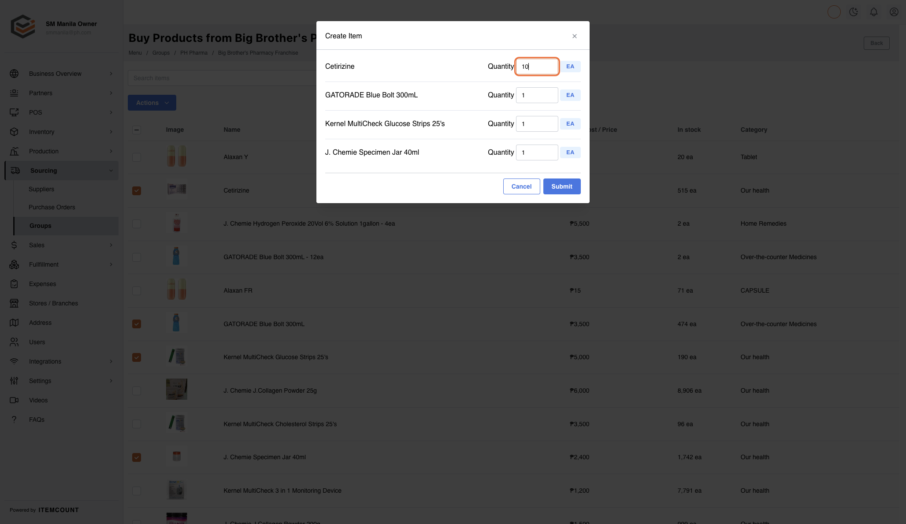
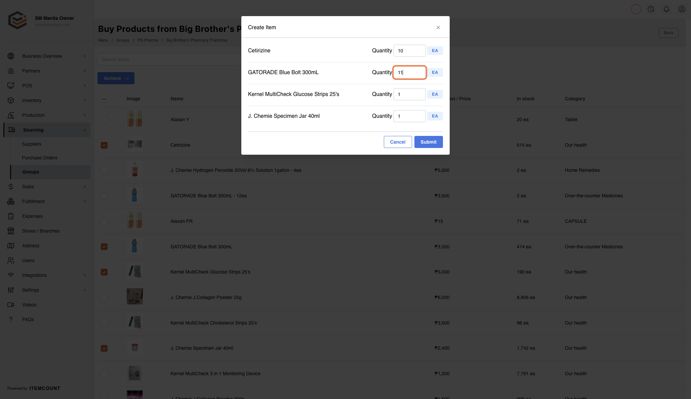
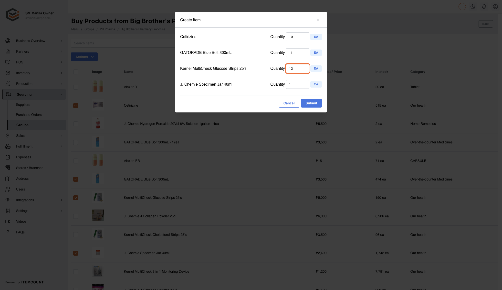
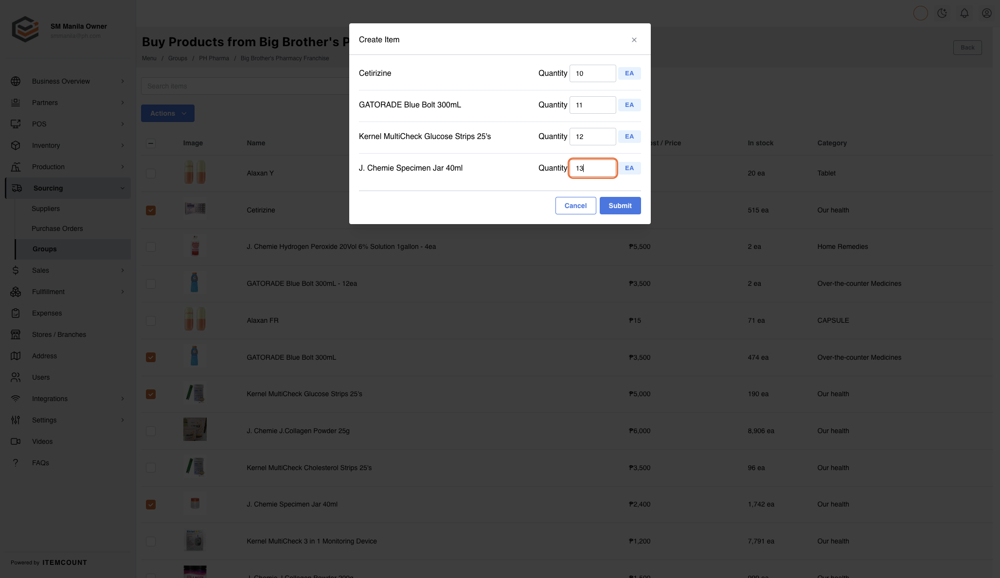
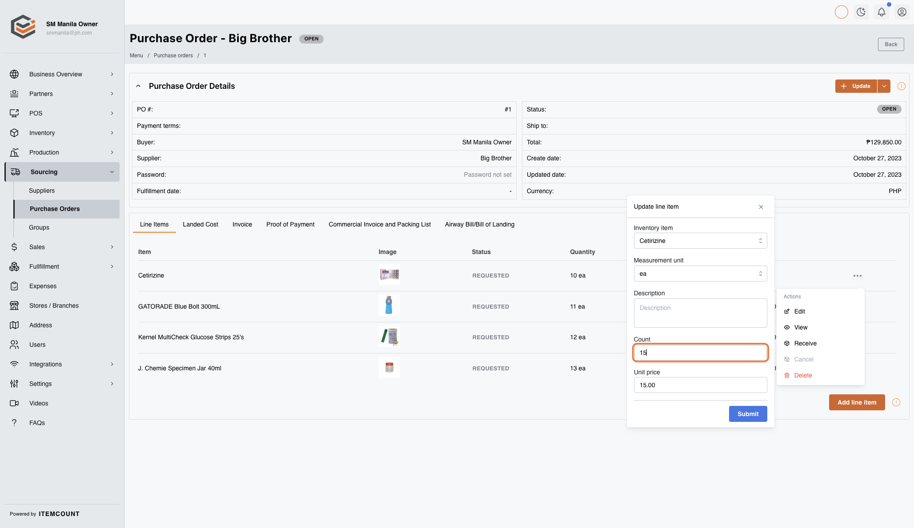

# Ordering Products to Franchisor

1. Click on Sourcing&#x20;

<figure><figcaption></figcaption></figure>

2. Click on Groups&#x20;

<figure><figcaption></figcaption></figure>

3. Click on PH Pharma&#x20;

<figure><figcaption></figcaption></figure>

4. Click on Big Brother's Pharmacy Franchise&#x20;

<figure><figcaption></figcaption></figure>

5. Check on&#x20;

<figure><figcaption></figcaption></figure>

6. Check on&#x20;

<figure><figcaption></figcaption></figure>

7. Check on&#x20;

<figure><figcaption></figcaption></figure>

8. Check on&#x20;

<figure><figcaption></figcaption></figure>

9. Click on Actions&#x20;

<figure><figcaption></figcaption></figure>

10. Click on Create Purchase Order&#x20;

<figure><figcaption></figcaption></figure>

11. Type "10"&#x20;

<figure><figcaption></figcaption></figure>

12. Type "11"

<figure><figcaption></figcaption></figure>

13. Type "12"&#x20;

<figure><figcaption></figcaption></figure>

14. Type "13"&#x20;

<figure><figcaption></figcaption></figure>

15. Click on Submit&#x20;

<figure><figcaption></figcaption></figure>

16. Click on dropdown trigger&#x20;

<figure><figcaption></figcaption></figure>

17. Click on Purchase Order - Big Brother…&#x20;

<figure><figcaption></figcaption></figure>

18. Click on dropdown trigger&#x20;

<figure><figcaption></figcaption></figure>

19. Click on Edit&#x20;

<figure><figcaption></figcaption></figure>

20. Type "15"&#x20;

<figure><figcaption></figcaption></figure>

21. Click on Submit

<figure><figcaption></figcaption></figure>
