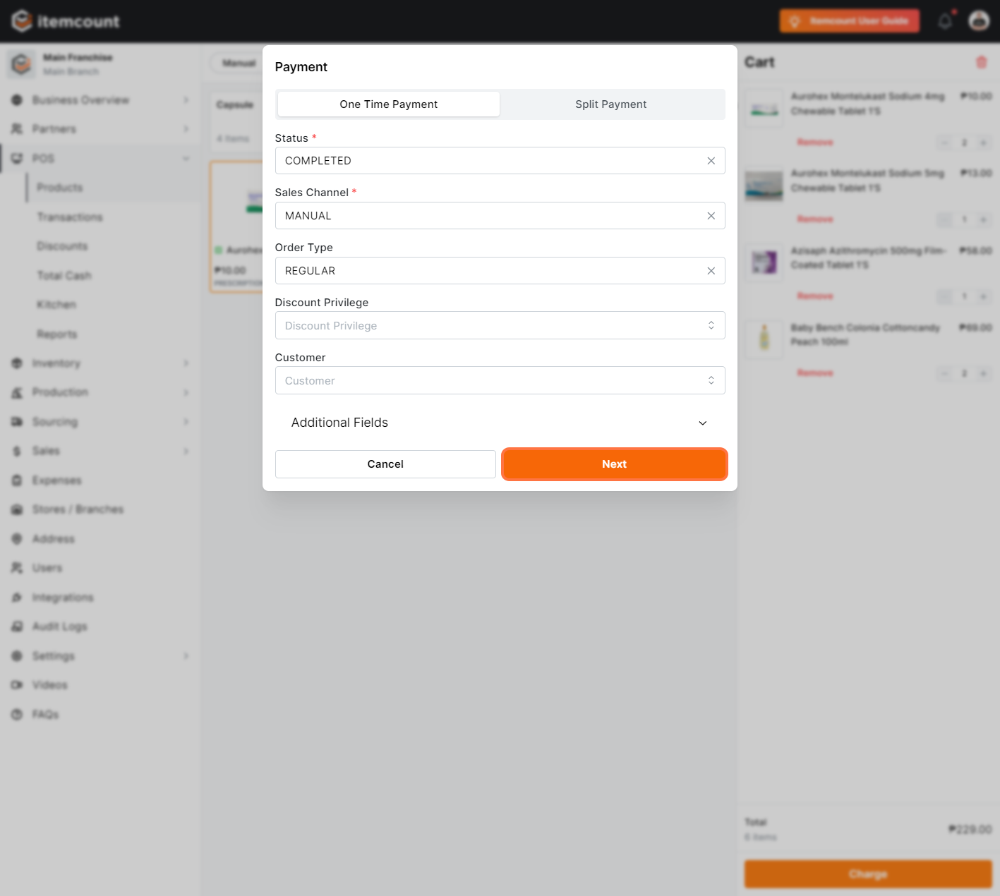
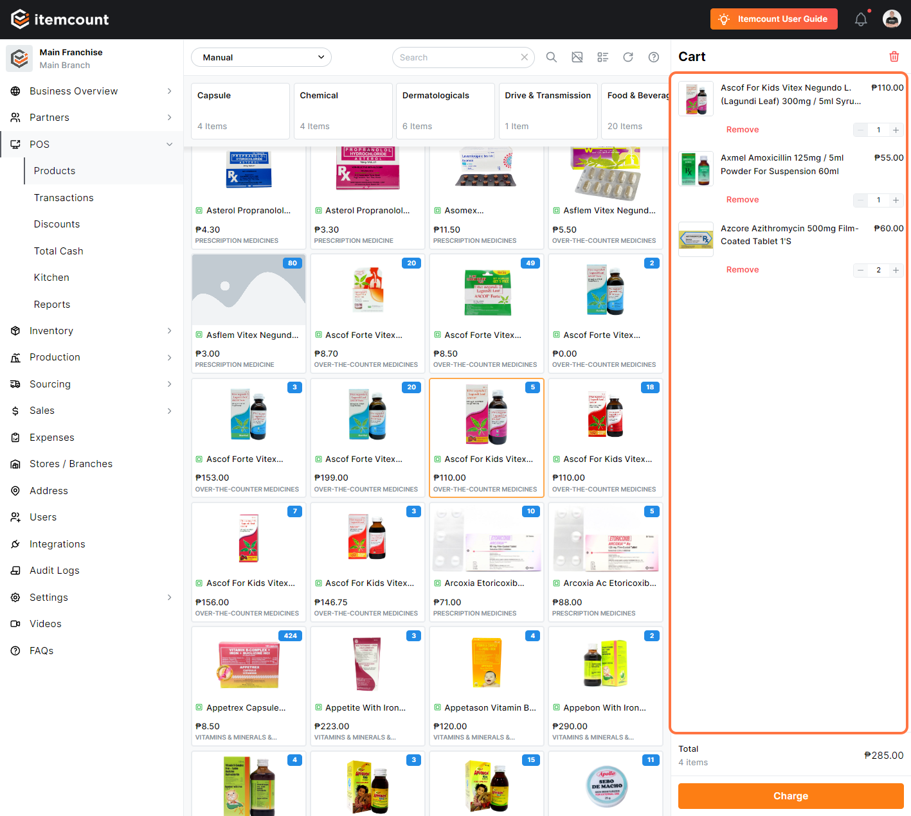
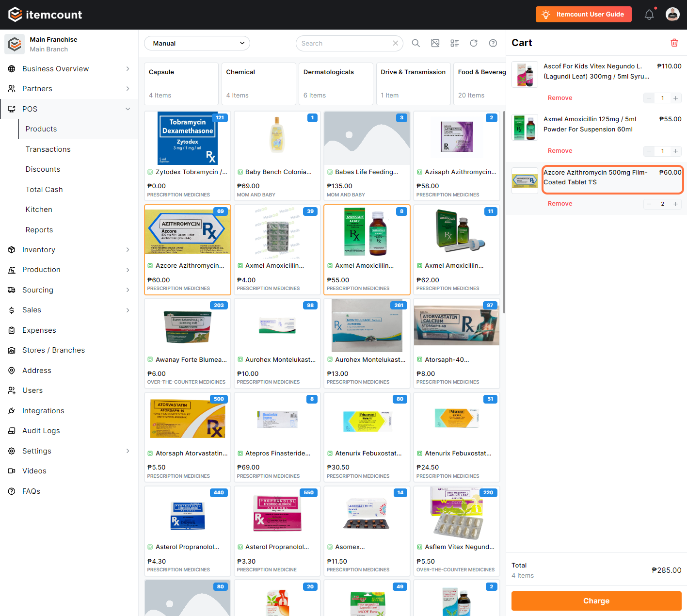
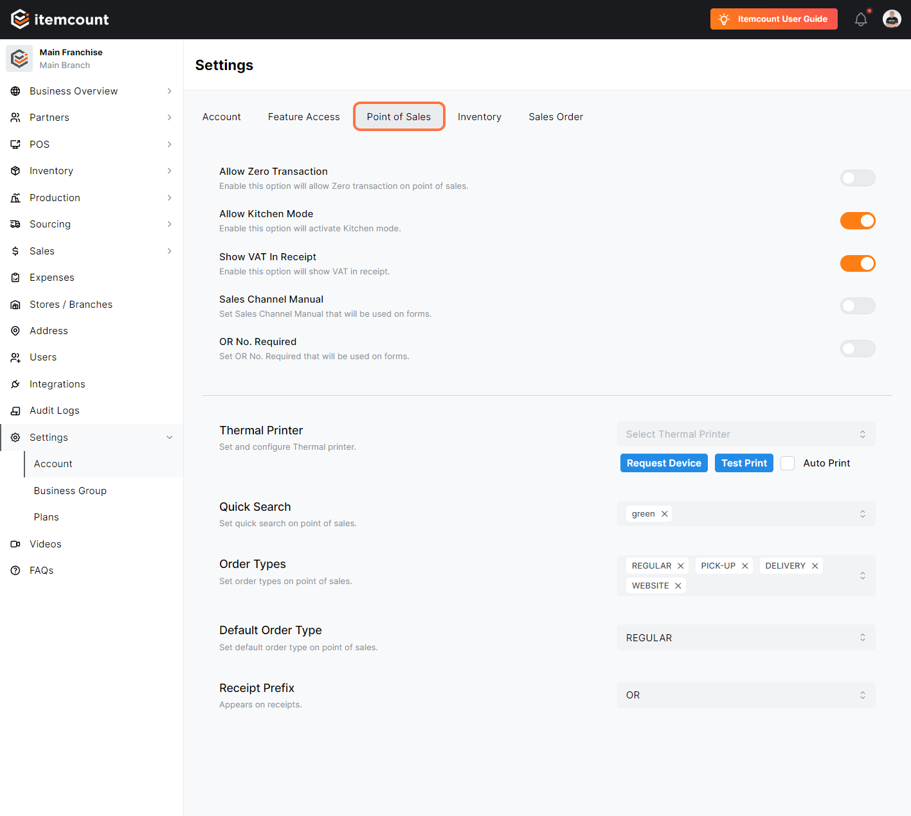
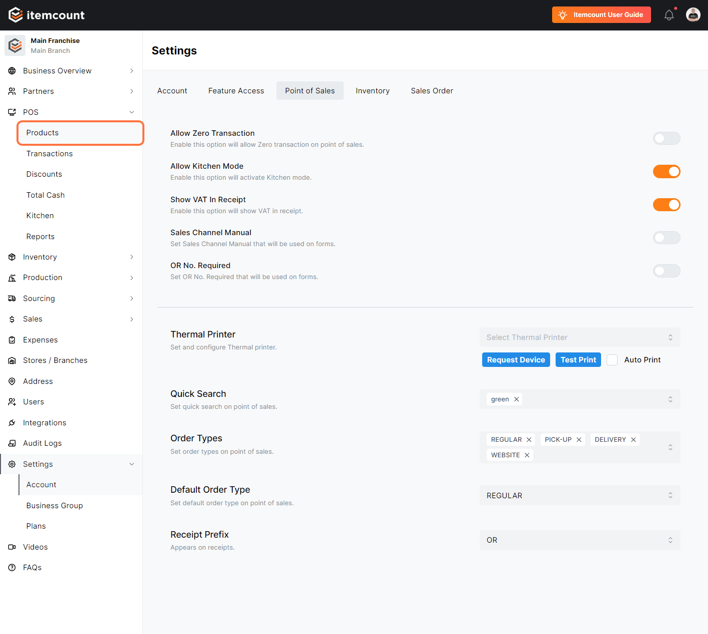
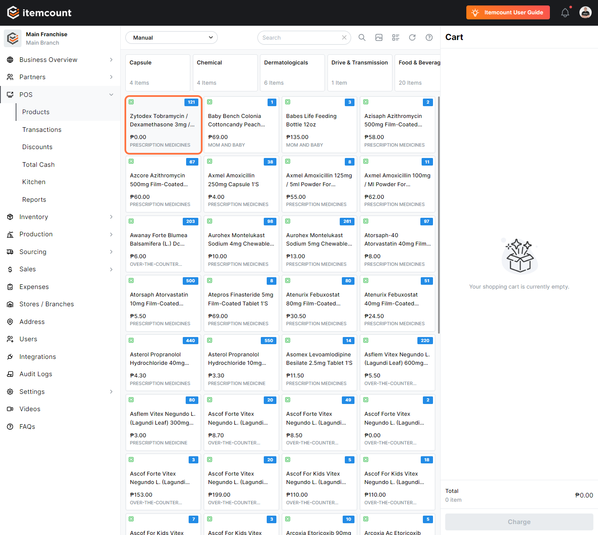
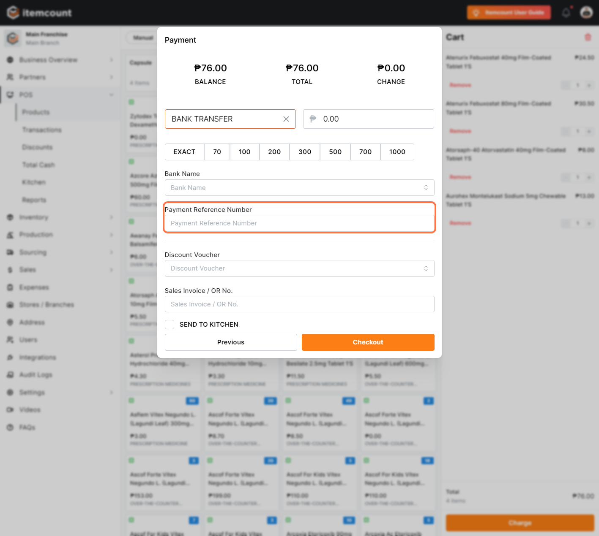

# How to Transact in POS (Discount privilege) (Freebies) (Sales Channel/payment channel)

1. **Click on POS Products**

<figure><figcaption></figcaption></figure>

2. **add items to be purchased**

<figure><figcaption></figcaption></figure>

3. cart display

<figure><figcaption></figcaption></figure>

4. **Click on Charge**

<figure><figcaption></figcaption></figure>

5. **Payment display**

<figure><figcaption></figcaption></figure>

6. **Click on Next**

<figure><figcaption></figcaption></figure>

7. **add the payment amount handed**

<figure><figcaption></figcaption></figure>

8. **Click on Checkout**

<figure><figcaption></figcaption></figure>

9. **Transaction complete (click on complete)**

<figure><figcaption></figcaption></figure>

### **DISCOUNT PRIVILEGE**

10. **add items to be purchased**

<figure><figcaption></figcaption></figure>

11. **Cart display**

<figure><figcaption></figcaption></figure>

12. **Click the products you want to apply discount**

<figure><figcaption></figcaption></figure>

13. **Select the discount privilege you want to use**

<figure><figcaption></figcaption></figure>

14. **Click on Update**

<figure><figcaption></figcaption></figure>

15. **discount already applied to specific item**

<figure><figcaption></figcaption></figure>

16. Go to settings then click on account

<figure><figcaption></figcaption></figure>

17. **Click on Point of Sales**

<figure><figcaption></figcaption></figure>

18. **Click on Allow zero transaction**

<figure><figcaption></figcaption></figure>

19. Check on

<figure><figcaption></figcaption></figure>

20. &#x20;**Click on POS**

<figure><figcaption></figcaption></figure>

21. **Click on Products**

<figure><figcaption></figcaption></figure>


NOTE: items with zero (0) amount will automatically free


22. in your cart, click the item you want to set as free

<figure><figcaption></figcaption></figure>

&#x20; 23\. click on SET AS FREE

<figure><figcaption></figcaption></figure>

24. Click on Update

<figure><figcaption></figcaption></figure>

25. &#x20;The item is already free

<figure><figcaption></figcaption></figure>

### **SALES CHANNEL / PAYMENT CHANNEL**

27. &#x20;Cart display

<figure><figcaption></figcaption></figure>

28. Click on Charge

<figure><figcaption></figcaption></figure>

29. Click on Sales Channel

<figure><figcaption></figcaption></figure>

30. &#x20;Select on what channel this item is being sold

<figure><figcaption></figcaption></figure>

31. Click on Next

<figure><figcaption></figcaption></figure>

32. Payment display

<figure><figcaption></figcaption></figure>

33. Click on this box to pick which payment channel the customer will use.

<figure><figcaption></figcaption></figure>

34. NOTE: If you click on bank, you have to enter the bank name and payment reference number

<figure><figcaption></figcaption></figure>

35. &#x20;then Click on Checkout

<figure><figcaption></figcaption></figure>

