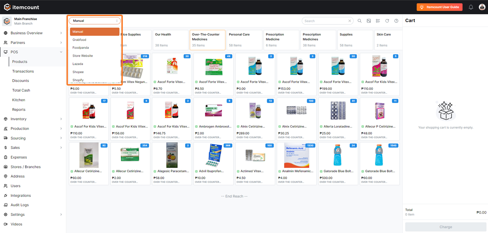
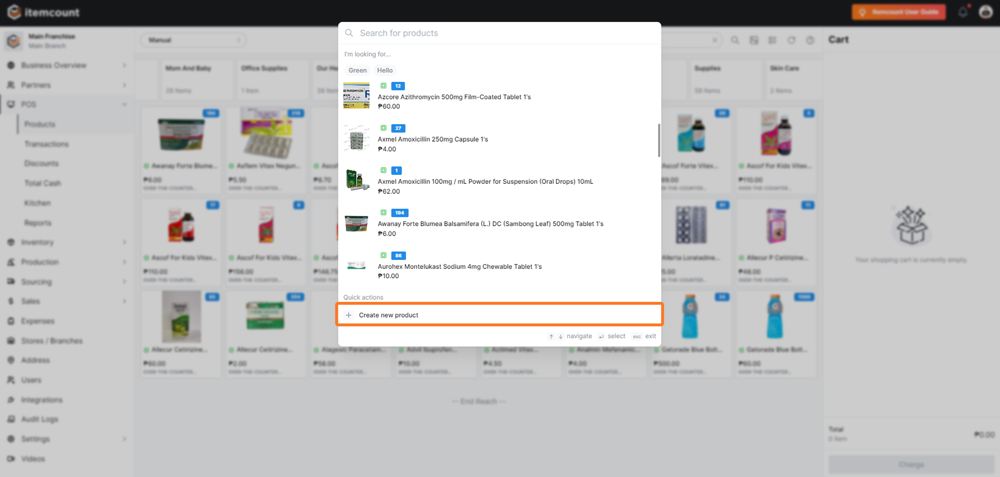
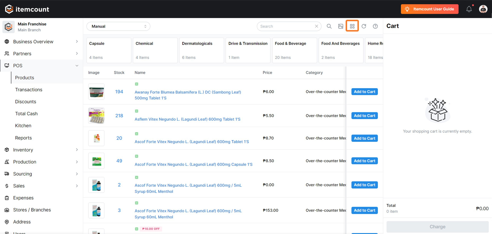
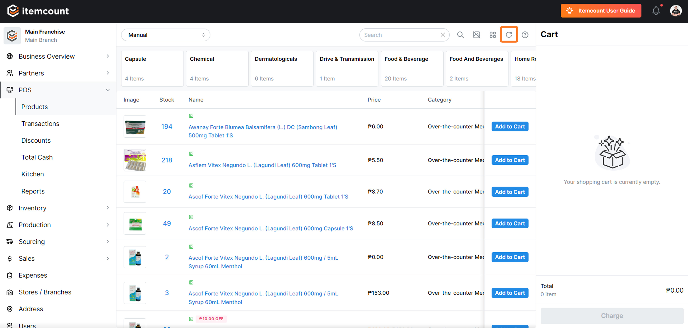

# POS Itemcount Tour

### <mark style="color:orange;">Welcome to the POS item count tour. Let's get started with a quick overview of the display.</mark>

<figure><figcaption></figcaption></figure>

***

1. First, click here to view more sales channels.

<figure><figcaption></figcaption></figure>

2. Scroll down and select the sales channel you intend to use.

<figure><figcaption></figcaption></figure>

3. Next, click this button to search for an item.

<figure><figcaption></figcaption></figure>

4. Type the name of the product you want to search for.

<figure><figcaption></figcaption></figure>

5. Click 'Create new product' to quickly set up items for sale.

<figure><figcaption></figcaption></figure>

6. Click this button to display photos in products.

<figure><figcaption></figcaption></figure>

7. Switch to list view by clicking here.

<figure><figcaption></figcaption></figure>

8. Refresh the page by clicking this button.

<figure><figcaption></figcaption></figure>

9. Check the item details here.

<figure><figcaption></figcaption></figure>

10. Finally, view your cart display here.

<figure><figcaption></figcaption></figure>

Visit my.itemcount.io for more details!

